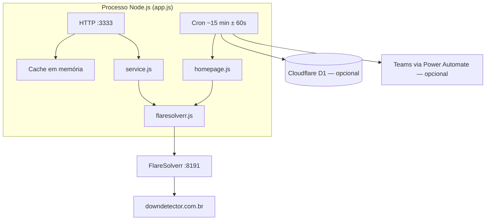

# Downdetector BR Scraper

API HTTP em Node.js para monitorar status de serviços no **[downdetector.com.br](https://downdetector.com.br/)**.

A coleta é feita **somente via FlareSolverr** (sem Chrome/Puppeteer na aplicação). Um cron em background atualiza o resumo da homepage a cada ~15 minutos; os endpoints `/api/*` exigem token.

Baseado no trabalho de **[Takdanai Deephuak (oTaKaTo)](https://github.com/oTaKaTo)** — ver [Créditos](#créditos).

---

## O que faz

1. Coleta a homepage e páginas de serviço via FlareSolverr (bypass do Cloudflare).
2. Expõe uma API JSON na porta `3333` (configurável).
3. Opcionalmente persiste alertas no **Cloudflare D1** e notifica o **Teams** via Power Automate.
4. Horários de relatos no fuso de Brasília (`America/Sao_Paulo`).

---

## Pré-requisitos

- Node.js ≥ 18
- [Docker](https://docs.docker.com/engine/install/) (para o FlareSolverr)
- [PM2](https://pm2.keymetrics.io/) (produção)
- [FlareSolverr](https://github.com/FlareSolverr/FlareSolverr) rodando (ex.: `http://127.0.0.1:8191/v1`)

### Instalar o Docker

Debian / Ubuntu:

```bash
# Pacotes base
sudo apt-get update
sudo apt-get install -y ca-certificates curl

# Repositório oficial Docker
sudo install -m 0755 -d /etc/apt/keyrings
sudo curl -fsSL https://download.docker.com/linux/debian/gpg -o /etc/apt/keyrings/docker.asc
sudo chmod a+r /etc/apt/keyrings/docker.asc

echo "deb [arch=$(dpkg --print-architecture) signed-by=/etc/apt/keyrings/docker.asc] \
  https://download.docker.com/linux/debian \
  $(. /etc/os-release && echo "$VERSION_CODENAME") stable" | \
  sudo tee /etc/apt/sources.list.d/docker.list > /dev/null

# Instalar Engine + Compose plugin
sudo apt-get update
sudo apt-get install -y docker-ce docker-ce-cli containerd.io docker-compose-plugin

# Subir o serviço e (opcional) permitir docker sem sudo
sudo systemctl enable --now docker
sudo usermod -aG docker "$USER"
# depois: saia e entre de novo na sessão SSH para o grupo valer

docker --version
```

> No **Ubuntu**, troque `linux/debian` por `linux/ubuntu` nas URLs acima (gpg e `sources.list`).  
> Guia oficial: https://docs.docker.com/engine/install/

### Instalar o FlareSolverr (Docker)

```bash
docker run -d --name flaresolverr --restart unless-stopped \
  -p 8191:8191 \
  ghcr.io/flaresolverr/flaresolverr:latest

docker ps | grep flaresolverr
curl -s http://127.0.0.1:8191/health
```

### Instalar o PM2

No servidor (global, uma vez):

```bash
npm install -g pm2
pm2 -v
```

Se o comando `pm2` não for encontrado, confirme que o npm global está no `PATH` (Node instalado via pacote oficial ou nvm).

---

## Instalação (produção com PM2)

```bash
# 0. Docker + FlareSolverr + PM2 (se ainda não instalou — ver Pré-requisitos)
npm install -g pm2

# 1. Código
cd /opt
git clone git@github.com:Luminous-Telecom/downdetector-zabbix.git downdetector-zabbix
cd downdetector-zabbix

# 2. Dependências
npm install --omit=dev

# 3. Ambiente
cp .env.example .env
openssl rand -hex 32   # cole o valor em API_TOKEN no .env
# Ajuste FLARESOLVERR_URL se o FlareSolverr não estiver em 127.0.0.1:8191

# 4. Subir com PM2 (NODE_ENV=production via ecosystem.config.cjs)
pm2 start ecosystem.config.cjs

# 5. Persistência após reboot
pm2 save
pm2 startup
# execute o comando que o pm2 startup imprimir (sudo env PATH=...)
```

Conferir:

```bash
pm2 status
pm2 logs downdetector-br
curl -s http://127.0.0.1:3333/
```

Comandos úteis:

| Comando | Ação |
|---|---|
| `pm2 restart downdetector-br` | Reinicia a API |
| `pm2 reload ecosystem.config.cjs` | Reload sem downtime (fork) |
| `pm2 stop downdetector-br` | Para o processo |
| `pm2 logs downdetector-br` | Logs em tempo real |
| `npm run pm2:start` | Atalho npm para o start |

Atualizar o servidor:

```bash
cd /opt/downdetector-zabbix
git pull
npm install --omit=dev
pm2 reload ecosystem.config.cjs
```

> **Importante:** use sempre **1 instância** (`ecosystem.config.cjs`). Cache em memória e cron interno não funcionam com cluster/múltiplos workers.

### Desenvolvimento local (sem PM2)

```bash
npm install
cp .env.example .env   # preencha API_TOKEN
npm start
```

### Variáveis principais

| Variável | Obrigatório | Descrição |
|---|---|---|
| `API_TOKEN` | Sim | Token de autenticação dos endpoints `/api/*` |
| `FLARESOLVERR_URL` | Sim | URL da API do FlareSolverr |
| `PORT` | Não | Porta HTTP (padrão `3333`) |
| `SUMMARY_INTERVAL_MS` | Não | Intervalo do cron da homepage (padrão 15 min) |
| `CACHE_TTL_MS` | Não | Cache do `/api/summary` (padrão 15 min) |
| `SERVICE_CACHE_TTL_MS` | Não | Cache do `/api/service/:slug` (`0` = sempre fresco) |
| `CLOUDFLARE_*` / `D1_*` | Não | Persistência de alertas no D1 |
| `POWER_AUTOMATE_WEBHOOK_URL` | Não | Notificações no Teams |
| `R2_*` | Não | Upload de screenshots (legado/opcional) |

---

## Autenticação

Todos os endpoints `/api/*` exigem o token (a raiz `GET /` é pública).

```bash
# Bearer
curl -H "Authorization: Bearer $API_TOKEN" \
  http://localhost:3333/api/service/caixa

# Header
curl -H "X-API-Token: $API_TOKEN" \
  http://localhost:3333/api/summary

# Query
curl "http://localhost:3333/api/service/caixa?token=$API_TOKEN"
```

Sem token → `401 Unauthorized`.

Para forçar nova coleta (ignorar cache):

```bash
curl -H "Authorization: Bearer $API_TOKEN" \
  "http://localhost:3333/api/summary?refresh=1"

curl -H "Authorization: Bearer $API_TOKEN" \
  "http://localhost:3333/api/service/caixa?refresh=1"
```

---

## Endpoints

| Método | Caminho | Auth | Descrição |
|---|---|---|---|
| `GET` | `/` | Não | Status da API + telemetria do cron |
| `GET` | `/api/services` | Sim | Lista pré-definida (`src/config/services.json`) |
| `GET` | `/api/summary` | Sim | Resumo da homepage (cache do cron) |
| `GET` | `/api/service/:slug` | Sim | Detalhe de um serviço (ex.: `caixa`) |
| `GET` | `/api/alerts` | Sim | Histórico de alertas no D1 |

### Exemplo — `/api/service/caixa`

```json
{
  "fetchedAt": "21/07/2026, 6:20 PM",
  "slug": "caixa",
  "name": "Caixa Econômica Federal",
  "status": "WARNING",
  "rawStatus": "Possíveis problemas",
  "reports": 34,
  "reportsBaseline": 4,
  "reportsAt": "21/07/2026, 6:05 PM",
  "peakReports24h": 70,
  "stale": false
}
```

| Campo | Significado |
|---|---|
| `reports` | Relatos do **último ponto** do gráfico (valor atual) |
| `reportsBaseline` | Linha de base do mesmo ponto |
| `reportsAt` | Horário do ponto em Brasília |
| `peakReports24h` | Pico nas últimas 24 h |
| `status` | `OK` \| `WARNING` \| `DOWN` |

Status derivados do texto do site:

- `sem problemas` → `OK`
- `possíveis problemas` → `WARNING`
- `problemas` → `DOWN`

---

## Arquitetura



Fluxo do cron:

1. Coleta homepage via FlareSolverr.
2. Grava no cache (`/api/summary`).
3. Diff de status vs alertas ativos no D1 (se configurado).
4. Envia notificação ao Teams (se webhook configurado).

---

## Estrutura de arquivos

```
downdetector/
├── app.js                 ← servidor HTTP + cron
├── ecosystem.config.cjs   ← PM2 (produção, 1 instância)
├── src/
│   ├── flaresolverr.js    ← cliente FlareSolverr
│   ├── homepage.js        ← parse da homepage
│   ├── service.js         ← parse da página do serviço + dataPoints
│   ├── statusUtils.js     ← normalização OK/WARNING/DOWN
│   ├── timeBr.js          ← horários em Brasília
│   ├── cache.js           ← cache TTL em memória
│   ├── statusDiff.js      ← diff de incidentes
│   ├── d1Client.js        ← Cloudflare D1
│   ├── notifier.js        ← webhook Teams
│   ├── r2Uploader.js      ← R2 (opcional)
│   └── config/
│       └── services.json  ← lista de serviços
├── .env
├── .env.example
└── package.json
```

---

## Banco (Cloudflare D1 — opcional)

Tabelas criadas automaticamente na subida, se as credenciais estiverem no `.env`:

### `summaries`
Histórico dos scrapes da homepage.

### `alerts`
Status atual dos serviços com incidente aberto (`DOWN` / `WARNING`).

### `alerts_history`
Log append-only do ciclo de cada incidente.

---

## Decisões de desenho

| Decisão | Motivo |
|---|---|
| Só FlareSolverr | Mais estável no BR contra Cloudflare do que Puppeteer headless |
| `setTimeout` em cadeia | Evita cron sobreposto se a coleta atrasar |
| Jitter ±60 s | Reduz padrão fixo de acesso |
| `API_TOKEN` obrigatório | Protege a API de uso anônimo |
| `SERVICE_CACHE_TTL_MS=0` | `/api/service` sempre fresco (o site muda com frequência) |
| `?refresh=1` | Força nova coleta quando necessário |
| Horário em Brasília | Alinhado ao que o Downdetector BR exibe |

---

## Troubleshooting

| Sintoma | O que checar |
|---|---|
| `401 Unauthorized` | `API_TOKEN` no `.env` e no header/`?token=` |
| `FlareSolverr HTTP` / challenge | Container no ar em `:8191`; `FLARESOLVERR_URL` |
| Dados “atrasados” no summary | Cron de 15 min ou `?refresh=1` |
| D1 / notify com erro | Credenciais opcionais vazias — a coleta da API continua funcionando |
| PM2 cai após reboot | Rodar `pm2 save` e `pm2 startup` (e o comando sudo sugerido) |
| `EADDRINUSE :3333` | Já há outro processo na porta — `pm2 status` / `ss -tlnp \| grep 3333` |

---

## Créditos

Este projeto é uma adaptação para o **Downdetector Brasil** do scraper original criado por:

- **[Takdanai Deephuak (oTaKaTo)](https://github.com/oTaKaTo)**
- Repositório original: **[oTaKaTo/downdetector-scraper](https://github.com/oTaKaTo/downdetector-scraper)**

A versão atual mantém a ideia da API HTTP + monitoramento contínuo, mas troca Puppeteer por FlareSolverr, aponta para `downdetector.com.br` e adiciona autenticação por `API_TOKEN`.

---

## Licença

MIT — copyright original de Takdanai Deephuak (ver `LICENSE`).
